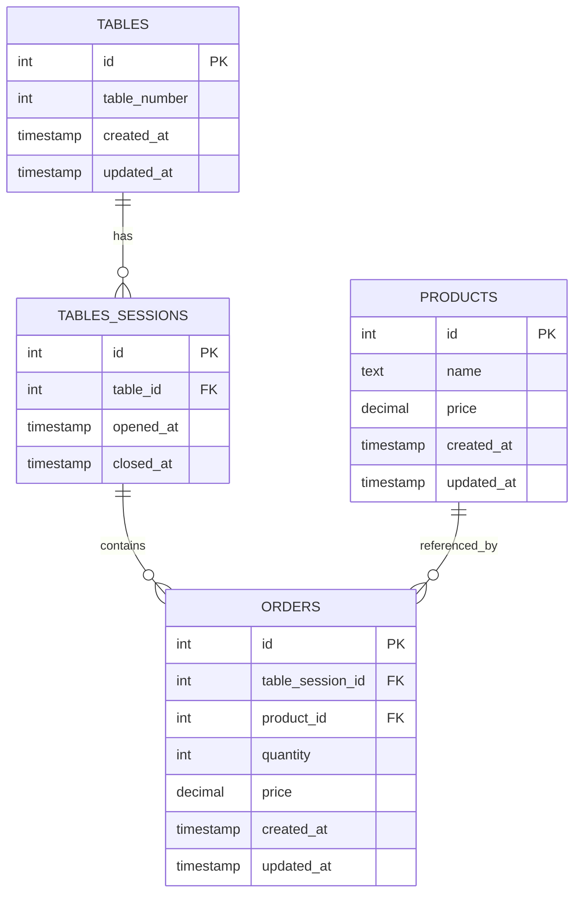

# Restaurant API

A REST API for restaurant management, handling products, tables, table sessions, and orders. Built with Node.js, Express, and TypeScript.

> **Note:** This project is based on a challenge from the [Rocketseat](https://www.rocketseat.com.br/) Fullstack curriculum. I revisited and implemented this solution independently to consolidate backend fundamentals, including database modeling, API design, and error handling patterns.

## Technologies

- Node.js 20
- Express
- TypeScript
- Knex.js (Query Builder)
- SQLite
- Zod (Validation)
- Swagger/OpenAPI 3.0

## Database Schema



## Getting Started

### Prerequisites

- Node.js 20+

### Installation

```sh
npm install
```

### Database Setup

Run migrations:

```sh
npm run knex -- migrate:latest
```

Seed the database (optional):

```sh
npm run knex -- seed:run
```

### Run the Server

```sh
npm run dev
```

Server runs at `http://localhost:3333`.

## API Documentation

Interactive API documentation is available via Swagger UI:

```
http://localhost:3333/api-docs
```

### Endpoints Overview

| Resource          | Method | Endpoint                 | Description                     |
|-------------------|--------|--------------------------|---------------------------------|
| Products          | GET    | `/products`              | List all products               |
| Products          | POST   | `/products`              | Create a product                |
| Products          | PUT    | `/products/:id`          | Update a product                |
| Products          | DELETE | `/products/:id`          | Delete a product                |
| Tables            | GET    | `/tables`                | List all tables                 |
| Tables            | POST   | `/tables`                | Create a table                  |
| Tables            | DELETE | `/tables/:id`            | Delete a table                  |
| Table Sessions    | GET    | `/tables-sessions`       | List all sessions               |
| Table Sessions    | POST   | `/tables-sessions`       | Open a session                  |
| Table Sessions    | PATCH  | `/tables-sessions/:id`   | Close a session                 |
| Orders            | POST   | `/orders`                | Create an order                 |
| Orders            | GET    | `/orders/:id`            | List orders by session          |
| Orders            | GET    | `/orders/:id/total`      | Get session total               |

## Project Status

In active development. Core functionality is implemented and functional.
